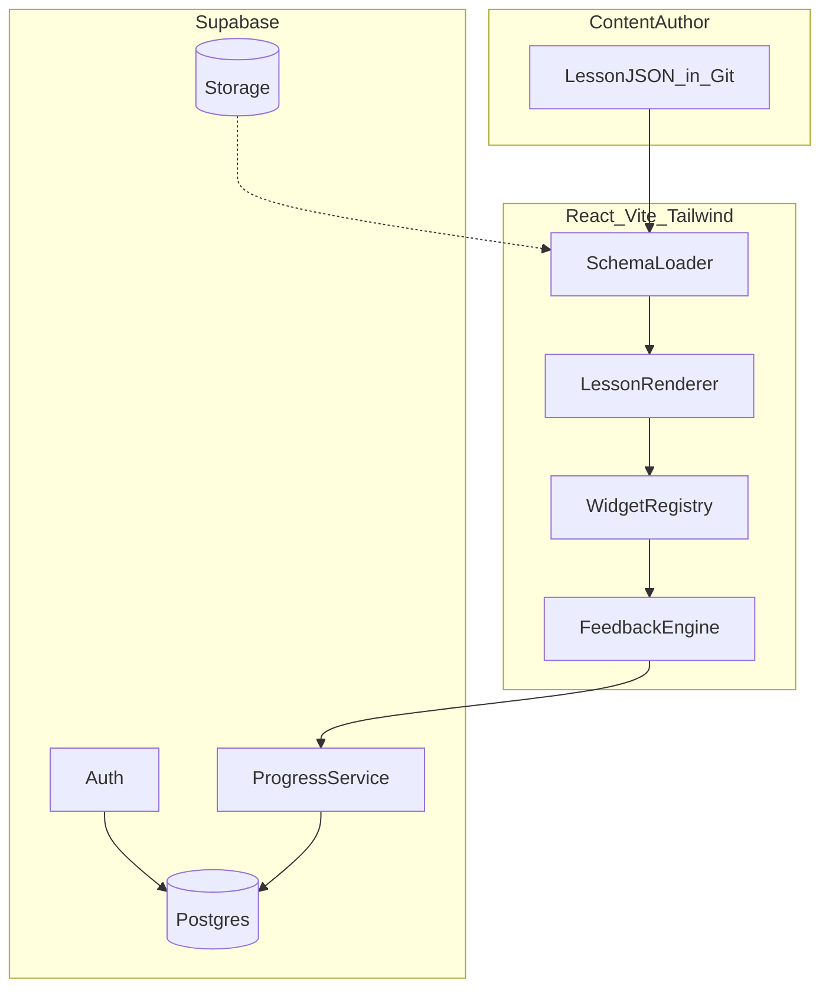

# bREALliant — Product Requirements Document (MVP)

## 1. Overview

**bREALliant** is a Brilliant-like learn-by-doing web app for **real analysis**. Engineering builds the **platform** (renderer, schema, progress, auth); the **content author** writes lessons in JSON.

- **Content domain (reference):** early Baby Rudin topics — construction of ℚ, ℝ, ℂ; least upper bound property; compactness; basic topology
- **MVP bar:** one hand-authored lesson proves the platform teaches via interaction; depth over lesson count
- **MVP rule:** no AI — zero LLM calls; all feedback from JSON

### Personas (equal priority, shared path)

Both personas follow the **same lessons and prerequisite graph**. Content author addresses differing needs through motivation blocks, hint depth, and step scaffolding — not separate tracks.

#### Alex — undergraduate math student

- **Age / context:** 17-20, undergraduate math+CS major; taking or preparing for a real analysis course alongside abstract algebra
- **Background:** Strong in calculus and linear algebra; comfortable with proofs but new to ε–δ rigor and supremum/infimum arguments; participated in mathematics olympiads before
- **Goals:** Build genuine intuition for limits and the real number system; perform well on problem sets; enjoy math, not just pass
- **Frustrations:** Textbooks and lectures feel abstract before intuition clicks; static PDFs don't let them *test* a guess; MCQ quizzes feel like trivia, not understanding
- **Behavior:** Uses the app on laptop between classes and on phone before bed; motivated by streaks and visible progress through Rudin-aligned units; willing to struggle on a problem if feedback is specific
- **Platform needs:** Motivation and intuition hooks (why completeness matters); discover steps where manipulating a number line *reveals* the lub property; instant feedback that references what they tried; short-to-medium lessons (~5–20 min) that feel completable in one sitting
- **Success looks like:** Can explain why √2 exists in ℝ but not ℚ; finishes a lesson feeling "I figured that out" rather than "I memorized a definition"

#### Sam — graduate student (non-math)

- **Age / context:** 21-24, first- or second- year economics or physics PhD; needs real analysis for measure-theoretic probability and optimization coursework
- **Background:** Solid undergraduate calculus and some linear models; rusty on formal proofs; learning analysis out of necessity, not pure interest
- **Goals:** Grasp enough analysis to follow grad econometrics and micro foundations; pass qualifying-style material; minimize time spent confused without guidance
- **Frustrations:** Rudin feels dense and unmotivated; hard to tell if a wrong answer is a typo or a conceptual gap; no time to re-watch long lectures; needs to pick up exactly where they left off across devices
- **Behavior:** Snatches 15-minute sessions on phone between seminars; prefers clear "why this matters" framing tied to applications; relies on wrong-answer hints to self-correct without office hours
- **Platform needs:** Applied motivation in content (e.g. why compactness matters for optimization); progressive hints on problem steps; prerequisite graph so they never skip foundations; resume mid-lesson with widget state intact
- **Success looks like:** Can read a statement like "every bounded infinite subset of ℝ has a limit point" and connect it to something they will use; returns tomorrow because streak and next lesson are visible

### User stories

#### US-01 — Guided discovery of a new concept (Alex)

**As** Alex, **I want** to explore a concept interactively before seeing the formal definition, **so that** I build intuition I can carry into proofs.

**Scenario:** Alex opens the lesson "The Least Upper Bound Property." The motivation step poses: "Does every bounded set have a smallest upper bound?" The discover step shows a number line with a bounded set E; Alex drags candidate upper bounds and watches which fail. Only after experimenting does the summary step state the formal lub definition.

**Acceptance:** Discover widget responds at 60 FPS; Alex can reach the summary without submitting a correct problem answer; step sequencer preserves discover widget state if Alex navigates back.

---

#### US-02 — Recover from a wrong answer without giving up (Jordan)

**As** Jordan, **I want** specific feedback when my answer is wrong, **so that** I can fix my understanding and continue without abandoning the session.

**Scenario:** On a fill-blank problem asking for sup E, Jordan enters an value that is an upper bound but not the *least* one. Feedback says: "That's an upper bound, but E has a smaller one — try adjusting your point on the number line." Jordan retries and succeeds; streak is unchanged; lesson progress stays on the same step until correct.

**Acceptance:** Feedback appears in &lt;100ms; message matches a content-defined incorrect pattern (not a generic "wrong"); Jordan can retry indefinitely; progress saves after each attempt.

---

#### US-03 — Resume mid-lesson across devices (Jordan)

**As** Jordan, **I want** to pause mid-lesson and continue later on a different device, **so that** short study windows are productive.

**Scenario:** Jordan completes motivation and discover on a laptop, then leaves during problem step 3 with the number line marker at 1.5. That evening on phone, Jordan opens the app, sees the lesson marked "in progress," and lands on step 3 with the marker still at 1.5.

**Acceptance:** `lesson_progress` restores `step_id` and `step_state` jsonb; course path shows in-progress badge; no data loss after tab close or logout/login.

---

#### US-04 — See where to go next on the course path (Alex)

**As** Alex, **I want** a clear course path that unlocks lessons as I complete prerequisites, **so that** I always know the next sensible step in real analysis.

**Scenario:** Alex completes "Bounds and Suprema" (no prerequisites). The path unlocks "The Least Upper Bound Property" and highlights it as recommended. "Compact Sets in ℝ" stays locked until its prerequisites (lub + topology basics) are done. Alex's streak shows 4 days.

**Acceptance:** Locked lessons are visually distinct and not navigable; completing a lesson writes to `lesson_completions` and re-evaluates unlock state; at least one unlocked lesson is highlighted when available.

## 2. Scope

### In scope

- JSON content model with schema validation (CI + author CLI)
- Lesson renderer: motivation → discover → problem → summary → quiz
- Widget registry (≥1 non-MCQ widget in MVP)
- Instant content-driven feedback via math.js validators
- Auth (email + password + username)
- Progress persistence and mid-lesson resume
- Course path with **prerequisite graph** unlock (`prerequisites[]`)
- Streaks and lesson-complete milestones
- Mobile-responsive UI; public deployment
- Tier C testing (Tier D stretch)

### Out of scope

- Lesson content authoring (author responsibility)
- OAuth / social login
- Phase 2 AI features; Phase 3 learning science integration
- Persona-specific content tracks
- Multi-subject support; video/HTML-blob lessons
- Social aspects / chat integrations

## 3. Content model

### Hierarchy

`Course → Unit → Lesson → Step → Widget / Blocks`

### Lesson cadence (platform must support)

| Step type | Purpose |
|-----------|---------|
| `motivation` | Hook, context, inquiry — blocks only |
| `discover` | Interactive exploration before formalism |
| `problem` | Graded interaction + validator + feedback |
| `summary` | Post-discovery recap |
| `quiz` | Retrieval-style reinforcement |

### Widget kinds

| kind | Interaction |
|------|-------------|
| `number_line` | Drag points, adjust intervals |
| `slider` | Parameter adjust + linked visual |
| `fill_blank` | Typed/templated input |
| `drag_order` | Reorder items |
| `multiple_choice` | Select one |

### Blocks & validators

- **Blocks:** `text` (markdown/plain), `math` (LaTeX via KaTeX)
- **Validator:** `{ type, engine: "mathjs", accept[], tolerance? }` — client-side for &lt;100ms feedback
- **Feedback:** `correct` string + `incorrect[]` with pattern-matched hints

### Example lesson fragment

```json
{
  "lessonId": "lesson-lub-01",
  "title": "The Least Upper Bound Property",
  "tags": ["lub", "supremum"],
  "prerequisites": ["lesson-bounds-01"],
  "steps": [
    { "id": "s1", "type": "motivation", "blocks": [{ "type": "math", "latex": "\\sup E" }] },
    { "id": "s2", "type": "discover", "widget": { "kind": "number_line", "props": {} } },
    {
      "id": "s3", "type": "problem",
      "widget": { "kind": "fill_blank", "props": { "template": "sup E = {{answer}}" } },
      "validator": { "type": "expression", "accept": ["1"], "engine": "mathjs" },
      "feedback": { "correct": "...", "incorrect": [{ "match": "*", "message": "..." }] }
    },
    { "id": "s4", "type": "summary", "blocks": [] },
    { "id": "s5", "type": "quiz", "items": [] }
  ]
}
```

### Content storage (hybrid)

| Layer | Role |
|-------|------|
| **Git** (`content/`) | Source of truth; CI schema validation; dev builds |
| **Supabase Storage** | Prod bundle synced on deploy (Should; MVP may start git-only) |
| **Loader** | Dev → git import; Prod → Storage URL, git fallback |

## 4. Requirements

| ID | Pri | Requirement | Acceptance criteria |
|----|-----|-------------|---------------------|
| REQ-001 | Must | Email + username auth | Sign up/in/out via email+password; username in UI |
| REQ-002 | Must | JSON-driven lessons | Course path and lessons render from JSON; no hardcoded HTML |
| REQ-003 | Must | Step sequencer | Forward/back navigation; per-step state preserved |
| REQ-004 | Must | Widget registry | Supported `widget.kind` renders without renderer code changes |
| REQ-005 | Must | Instant feedback | &lt;100ms; message from JSON; pattern-matched wrong-answer hints |
| REQ-006 | Must | Progress persistence | `userId + lessonId + stepId + stepState` in Supabase |
| REQ-007 | Must | Mid-lesson resume | Same step and widget state after cross-device return |
| REQ-008 | Must | Prerequisite unlock | Locked until all `prerequisites[]` complete |
| REQ-009 | Must | Course path UI | Units/lessons with completed / in-progress / locked states; next unlocked highlighted |
| REQ-010 | Must | Habit loop | Streak counter + lesson-complete milestone |
| REQ-011 | Must | Mobile + deploy | Touch-friendly (≥44px targets); public HTTPS URL |
| REQ-012 | Must | No AI | Zero LLM/API calls |
| REQ-013 | Should | LaTeX via KaTeX | Math blocks render correctly |
| REQ-014 | Should | CI schema validation | Invalid lesson JSON fails PR/build |
| REQ-015 | Should | Storage sync | Deploy uploads validated bundle to Supabase Storage |
| REQ-016 | Could | Offline shell | Service worker caches lesson JSON |

### Non-functional

| ID | Target |
|----|--------|
| NFR-001 | Feedback &lt;100ms |
| NFR-002 | Widgets ≥60 FPS during manipulation |
| NFR-003 | First interaction &lt;2s on mid-range mobile |
| NFR-004 | Concurrent learners without degradation |

### UX principles

- Minimal chrome; lesson content is hero
- Readable math typography; inline feedback (correct/incorrect visually distinct)
- Step progress indicator within lesson; keyboard navigation where feasible

## 5. Architecture



### Components

| Component | Responsibility |
|-----------|----------------|
| SchemaLoader | Fetch/import JSON; validate schema |
| LessonRenderer | Step sequencer, blocks, layout |
| WidgetRegistry | `widget.kind` → React component |
| FeedbackEngine | Run validators; resolve feedback |
| ProgressService | Lesson state read/write |
| CoursePathUI | Unit/lesson list, unlock logic, recommendations |

### Supabase schema

| Table | Key fields |
|-------|------------|
| `profiles` | `id`, `username`, `email`, `created_at` |
| `lesson_progress` | `user_id`, `lesson_id`, `step_id`, `step_state` (jsonb), `completed`, `updated_at` |
| `lesson_completions` | `user_id`, `lesson_id`, `completed_at`, `tags[]` |
| `streaks` | `user_id`, `current_streak`, `last_activity_date` |

RLS: users read/write own rows only.

## 6. Tech stack

| Layer | Choice |
|-------|--------|
| Frontend | React (Vite) |
| Styling | **Tailwind CSS** |
| Math | KaTeX |
| Interactives | SVG + React (D3 optional) |
| Validation | math.js |
| Backend | Supabase (Auth, Postgres, Storage) |
| Deploy | Vercel + Supabase hosted |
| Test | Vitest (unit/component) + Playwright (E2E) |

## 7. Testing

**Tier C — Platform** (required) · **Tier D — Full** (stretch)

| Tier | Coverage |
|------|----------|
| **C** | Unit: schema, validators, feedback matching, progress/resume · Component: ≥2 widget kinds · E2E: auth → lesson complete; wrong-answer recovery; mid-lesson resume; mobile viewport (375px) · CI on PR |
| **D** | Visual regression (Chromatic/Percy) · perf budget checks · load smoke · HITL checklist for interactives |

## 8. Definition of done

- [ ] One author-supplied lesson runs end-to-end from JSON
- [ ] ≥1 manipulation widget with real-time visual response
- [ ] Content-defined feedback on correct and incorrect answers
- [ ] Progress + streak persist; mid-lesson resume on mobile
- [ ] Prerequisite unlock and next-lesson highlight on path
- [ ] Email + username auth
- [ ] Public deploy; Tier C tests green in CI

**Manual QA:** complete lesson with intentional wrong answers; manipulate widget; leave and return; verify path recommendation; full flow on phone viewport.

## 9. Future (not MVP)

- **Phase 2 — AI:** hints, problem generation, adaptive path; grounded in lesson state; app works with AI off
- **Phase 3 — Learning science:** spaced repetition, interleaving, mastery gating

## 10. Submission (Build Brilliant)

- GitHub repo with subject in README, setup guide, architecture, deployed link
- Demo video (3–5 min)
- Brainlift (1 page)
- Deployed app: public, auth, mobile-ready
